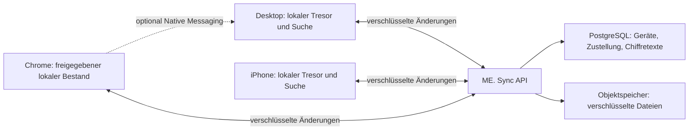

# ME. — Datenbankentscheidung mit Desktop, iPhone und Chrome

Recherche: 15. September 2026. Entscheidungsgrundlage, keine beschlossene Migration und keine implementierte Sync- oder Sicherheitsfunktion.

## Empfehlung und offene Entscheidung

ME. sollte geräteunabhängige, Ende-zu-Ende-verschlüsselte Datenänderungen und Dateiobjekte synchronisieren. Jedes berechtigte Gerät hält einen eigenständig nutzbaren lokalen Bestand und lokale Suchindizes. PostgreSQL passt gut auf die Serverseite für Konten, Geräte, Zustellmetadaten und verschlüsselte Nutzdaten. Es erhält keine Schlüssel zum persönlichen Inhalt.

Für die native Speicherung sind zwei Varianten tragfähig:

1. **Gemeinsamer nativer Tresorkern:** SQLCipher auf Desktop und iPhone; gemeinsame Fach-, Rechte- und Suchlogik, soweit plattformübergreifend umsetzbar. Browser mit verschlüsseltem lokalem Objektspeicher und eigener Suchprojektion. Das ist meine bevorzugte Gesamtarchitektur unter den bisherigen Anforderungen.
2. **PostgreSQL-Desktop:** PostgreSQL + pgvector auf dem Desktop, SQLCipher auf dem iPhone, eigener lokaler Browserspeicher. Dasselbe verschlüsselte Sync-Protokoll verbindet die Geräte. Diese Variante ist sinnvoll, wenn ein Vergleich einen relevanten Suchvorteil nachweist oder zusätzliche datenbankseitige Rechte auf dem Desktop ausdrücklich verlangt werden. Sie ist mit Sync vereinbar; sie bringt aber kein gemeinsames RLS-System für alle Geräte mit.

Die Empfehlung für den gemeinsamen Kern beruht auf nativer Tresorverschlüsselung, portabler Fachlogik und konsistentem Offlineverhalten. Ein Qualitätsvorsprung der Suche ist für keine Variante gemessen. Gute Suche ist ein Abnahmekriterium; ein unzureichender SQLite-Suchaufbau wäre kein akzeptabler Kompromiss.

Die vorherige Desktop-Betrachtung von PostgreSQL war technisch möglich, aber keine vollständige Entscheidung für die gesamte Produktfamilie. Insbesondere muss die iPhone-App auch bei ausgeschaltetem Desktop funktionieren.

Annahme für diese Untersuchung: Eine Chrome-Erweiterung soll perspektivisch auch eigenständig funktionieren können. Die Frage dazu wurde gestellt; bis zur Antwort werden beide Betriebsarten offengehalten. Die iPhone-App soll mindestens Daten ansehen, importieren und freigegebene Inhalte offline verwenden können. Dauerhafte Hintergrund-Agenten auf dem Handy werden nicht vorausgesetzt.

## Die entscheidende Grenze: Wo liegt der Klartext?

Mit gewöhnlicher Ende-zu-Ende-Verschlüsselung kann der Sync-Server verschlüsselte Änderungen speichern und zustellen, aber ihren Inhalt nicht per normalem SQL, Volltext oder pgvector durchsuchen. Unverschlüsselte Suchtexte und Embeddings auf dem Server wären eine zusätzliche Offenlegung persönlicher Informationen. Verschlüsselung des Datenträgers des Servers ändert daran nichts.

Folglich erfolgt die persönliche Suche auf einem entsperrten, berechtigten Gerät. Ein anderer eigener, eingeschalteter Rechner könnte später als ausdrücklich freigegebener Such- oder Agentenrechner dienen. Er erweitert den Kreis der Geräte mit Klartextzugriff und darf keine Voraussetzung für grundlegende mobile Suche werden.

Das ist mit bestehenden Sync-Produkten vereinbar: PowerSync beschreibt ausdrücklich das Synchronisieren verschlüsselter Daten und deren lokale Entschlüsselung, beispielsweise in getrennte lokale Abfragetabellen. Dieses Muster unterscheidet Transport von der lokalen Datenansicht. [PowerSync: Verschlüsselung](https://docs.powersync.com/client-sdks/advanced/data-encryption)

## Plattformen und Aufgaben

| Plattform | Lokaler Bestand | Aufgabe | Grenze |
|---|---|---|---|
| Desktop macOS/Linux | Vollständiger Tresor oder gewählte Bereiche; lokale Suche | Scanordner, Dokumentverarbeitung, Agenten, große Bestände | PostgreSQL ist als zusätzlicher Prozess bündelbar; seine Verschlüsselung und Updates sind eigens zu lösen |
| iPhone mit Swift-Oberfläche | Verschlüsselte Fakten, Suchinformationen und ausgewählte Originale | Import, Suche, Prüfung, später Autofill | Lokale Nutzung muss ohne Desktop und ohne aktuelle Netzverbindung funktionieren |
| Chrome mit Desktop | Abfragen an vertrauenswürdigen nativen Dienst, möglichst wenig eigene Daten | Import und kontextbezogenes Ausfüllen | Native Messaging und jede Anfrage müssen auf die erlaubte Erweiterung und den konkreten Kontext beschränkt sein |
| Eigenständiges Chrome | Verschlüsselte freigegebene Teilmenge, lokale Suchansicht nach Entsperren | Funktioniert auf einem Rechner ohne Desktop-App | Eigenständiger Schlüssel- und Gerätelebenszyklus, keine implizite Vollfreigabe |
| ME. Sync | Chiffretexte, verschlüsselte Dateiobjekte, notwendige Zustellmetadaten | Verfügbarkeit zwischen nicht gleichzeitig eingeschalteten Geräten | Keine fachliche Klartextsuche oder KI-Auswertung |

`postgresql-embedded` dokumentiert Bundling und Prozessverwaltung für Desktop-Plattformen. Das ist kein Nachweis einer entsprechenden nativen iPhone-Lösung. SQLCipher dokumentiert dagegen die Integration auf Apple-Plattformen. [PostgreSQL Embedded](https://github.com/theseus-rs/postgresql-embedded), [SQLCipher für Apple](https://www.zetetic.net/sqlcipher/sqlcipher-apple-community/)

PGlite führt PostgreSQL einschließlich pgvector in WebAssembly aus und kann im Browser IndexedDB verwenden. Es ist damit ein echter Kandidat für eine Browser-Suchansicht. Es liefert allein aber weder ME.-Gerätefreigaben noch Tresorschlüsselverwaltung und ist kein gleichwertiger nativer Swift-Speicher. RLS in einer vom Browser selbst kontrollierten Datenbank ist keine Grenze gegen kompromittierten Erweiterungscode mit Zugriff auf dieselbe Laufzeit. [PGlite](https://pglite.dev/), [PGlite API](https://pglite.dev/docs/api)

Chrome Native Messaging verbindet eine Erweiterung mit einem installierten nativen Programm; es ersetzt keinen Cloud-Sync. `chrome.storage.sync` ist für Einstellungen gedacht und hat ungefähr 100 KB Gesamtkapazität. Es ist keine geeignete Dokumenten- oder Tresorsynchronisation. Ein eigenständiger Browserclient würde stattdessen Chiffretexte etwa in IndexedDB/OPFS speichern, Schlüssel separat schützen und Klartextsuchindizes zunächst nur während der entsperrten Sitzung halten oder ausdrücklich verschlüsselt persistieren. [Native Messaging](https://developer.chrome.com/docs/extensions/develop/concepts/native-messaging), [Chrome Storage](https://developer.chrome.com/docs/extensions/reference/api/storage)

Chrome-Service-Worker können beendet werden. Warteschlangen und Empfangsstände müssen daher dauerhaft und wiederaufnehmbar sein. Ebenso muss das iPhone nach App-Start oder Netzrückkehr Änderungen nachholen. Apple zeigt am CKSyncEngine, dass Hintergrund-Sync durch den System-Scheduler abhängig von Netz, Energie und Last verzögert werden kann. Eine bestimmte Uhrzeit oder sekündliche Aktualisierung im Hintergrund ist deshalb kein verlässliches Produktversprechen. [Chrome-Lebenszyklus](https://developer.chrome.com/docs/extensions/develop/concepts/service-workers/lifecycle), [Apple: Sync-Scheduling](https://developer.apple.com/videos/play/wwdc2023/10188/)

## Rechte: Drei verschiedene Entscheidungen

1. **Geräteberechtigung:** Welche Daten darf dieses Gerät erhalten und entschlüsseln? Eine Erweiterung kann auf einen ausgewählten Bereich beschränkt sein.
2. **Agentenberechtigung:** Welche Informationen aus diesem lokalen Bestand darf ein konkreter Agentenauftrag bekommen? Die ME.-Anwendung kann mehr wissen als der Agent.
3. **Handlungsberechtigung:** Darf der Agent nur einen Entwurf erstellen oder eine konkret freigegebene Handlung ausführen?

Server-RLS kann Konten, Geräte und Zustellungen gegeneinander abgrenzen. Inhaltliche Agentenregeln auf Ende-zu-Ende-verschlüsselten Feldern werden lokal durchgesetzt. Auf einem PostgreSQL-Desktop kann lokales RLS zusätzliche Absicherung bieten. Auf einem SQLCipher-Client übernimmt diese Durchsetzung ein vom Agenten abgeschirmter Zugriffsdienst. Ein gemeinsamer Testkatalog prüft dieselben Regeln auf jeder Plattform.

PowerSync weist ausdrücklich darauf hin, dass RLS für bei PostgreSQL ankommende Operationen und Sync Streams für Downloads unterschiedliche Regelwerke sind. Sie müssen aufeinander abgestimmt werden. Electric autorisiert heruntergeladene Shapes über API/Middleware. Keines davon überträgt automatisch eine vollständige PostgreSQL-Rechteverwaltung in die lokale Clientdatenbank. [PowerSync: RLS und Sync Streams](https://docs.powersync.com/integrations/supabase/rls-and-sync-streams), [Electric: Auth](https://electric.ax/docs/sync/guides/auth)

Wichtige Konsequenzen für ME.:

- Freigaben an Fakten und Dokumenten ausrichten; eine Freigabe der Entität „David“ wäre für viele Aufgaben zu breit.
- Dokumente, Abschnitte, Zusammenfassungen, Vektoren und Originalabrufe müssen die gleichen inhaltlichen Grenzen beachten. Beziehungen dürfen gesperrte Inhalte nicht über Nebenwege offenlegen.
- Wer kryptografisch nur einen Teilbereich erhalten soll, bekommt nur dafür Schlüssel. Alle Daten mit einem gemeinsamen Schlüssel auszuliefern und anschließend im UI auszublenden bietet diese Trennung nicht.
- Geräte- und Agentenrechte dürfen nicht durch veränderbare Agentenparameter oder bloße Modellanweisungen bestimmt werden.
- Berechtigungsänderungen synchronisieren, aber ein offline befindliches Gerät kann einen Widerruf erst erfahren, wenn es wieder kommuniziert. Bereits entschlüsseltes oder kopiertes Wissen lässt sich nicht zurückholen.

## Was synchronisiert wird

Die Speichereinheit ist eine versionierte fachliche Änderung mit stabiler Kennung, Herkunft und Abhängigkeiten. SQL-Dateien, PostgreSQL-Datenverzeichnisse und SQLite-WAL-Dateien sind kein geräteübergreifendes Schreibprotokoll.

| Daten | Sync-Verhalten |
|---|---|
| Original-PDF, Foto, E-Mail | Unveränderliches verschlüsseltes Objekt; große Dateien separat und wiederaufnehmbar übertragen |
| Fakten und Beziehungen | Neue Aussagen und Revisionen mit Quelle und Gültigkeit |
| Annahme oder Ablehnung | Eigene nachvollziehbare Entscheidung mit Bezug auf die betreffende Revision |
| OCR-Text und Dokumentabschnitte | Versionierte abgeleitete Inhalte; optional verschlüsselt mitsynchronisieren, um Verarbeitung zu sparen |
| Embeddings | Optional verschlüsselt übertragen; Modellrevision, Dimension und Vorverarbeitung mitführen |
| FTS-/HNSW-Indizes | Auf jedem Gerät aus dem erlaubten Bestand aufbauen; keine binären Indizes replizieren |
| Lokale Schlüssel, Provider-Login | Nicht als gewöhnliche Anwendungsdaten synchronisieren |
| Löschungen | Versionierte Löschmarkierungen und definierte Aufbewahrung, damit alte Offlinegeräte Inhalte nicht wiederherstellen |
| Aufgaben | Auftrag, Entwurf, Freigabe und Ausführungsergebnis getrennt |

Ein logisches Änderungsformat funktioniert sowohl mit SQLCipher als auch mit PostgreSQL. Die lokale Datenbank ist eine persistente Sicht auf das akzeptierte Wissen; die fachliche Bedeutung darf nicht von einem konkreten SQL-Dialekt abhängen.

Das Protokoll braucht mindestens stabile Objekt- und Operations-IDs, Geräteidentität, Formatversion, kausale Vorgänger, Schlüsselversion und authentifizierten Inhalt. Was davon der Server für Routing benötigt und im Klartext sieht, wird minimiert und ausdrücklich dokumentiert. Die konkrete kryptografische Konstruktion ist noch zu spezifizieren und prüfen; hier wird kein eigenes Verschlüsselungsverfahren vorgeschlagen.

Lokale Fachänderung und Ausgangswarteschlange werden atomar gespeichert. Empfangene Änderungen und Empfangsstand ebenfalls. Wiederholte Übertragung derselben Operation darf keine zweite Fachänderung erzeugen. Uhrzeiten und Server-Eingangsreihenfolge allein bestimmen keinen inhaltlichen Gewinner.

### Konflikte

- Zwei verschiedene Briefe werden zusammengeführt.
- Zwei Geräte ändern unterschiedliche unabhängige Angaben: beide Änderungen bleiben erhalten.
- Zwei Geräte ändern dieselbe aktuelle Adresse unterschiedlich: beide Revisionen erhalten, ein gemeinsamer Klärungsfall.
- Eine neue Abrechnung verändert nicht automatisch das vertragliche Grundgehalt.
- Eine alte Offlinekopie darf eine Löschung nicht stillschweigend rückgängig machen. Für zu alte Geräte kann ein neuer vollständiger Abgleich erforderlich sein.
- Die Bestätigung eines Entwurfs bezieht sich auf seine konkrete Revision. Nach einer relevanten Änderung wird diese Bestätigung nicht auf einen neuen Entwurf übertragen.

CRDTs können gleichzeitige Bearbeitungen zusammenführen. Sie entscheiden nicht, welche von zwei Passnummern fachlich zutrifft. Automerge besitzt Rust-, Swift- und Browser-Anbindungen und ist besonders für Notiztexte interessant. Es muss nicht das komplette relationale Wissensmodell ersetzen. [Automerge](https://automerge.org/docs/hello/)

## Suche auf jedem Gerät

Offlineverfügbarkeit umfasst die Suchgrundlage, nicht zwingend jedes große Original. Das iPhone kann Dokumenttext, Fakten und relevante Vektoren lokal halten, während große PDFs bei Bedarf geladen oder ausdrücklich offline gespeichert werden. Der Browser kann mit einer freigegebenen Teilmenge arbeiten. Die Oberfläche unterscheidet „hier nicht heruntergeladen“, „noch nicht verarbeitet“ und „nicht vorhanden“.

Desktop und Handy sollten kompatible Dokument- und Anfrageembeddings verwenden. Ein Modellwechsel benötigt versionierte parallele Indizes oder vollständige Neuindexierung. Ein bereits synchronisierter Vektor vermeidet nicht die Berechnung eines passenden Anfragevektors. Darum muss ein lokales Modell beziehungsweise ein klar definierter Offline-Suchmodus auch auf dem iPhone und im Browser praktisch getestet werden.

SQLCipher + FTS5 + Vektorsuche bietet grundsätzlich eine hybride Suche; PostgreSQL + pgvector liefert zusätzliche integrierte Such- und Indexwerkzeuge. Der Speichername allein sagt nichts über gemessene Trefferqualität aus. Dieselben Dokumente, Fragen, erlaubten Teilmengen und Embeddings bilden die Vergleichsbasis. [FTS5](https://www.sqlite.org/fts5.html), [pgvector](https://github.com/pgvector/pgvector)

Die PostgreSQL-Variante darf mehr können oder schneller sein, ohne dass sie Sync behindert. Sie rechtfertigt sich dann durch einen messbaren Nutzen. Eine zusätzliche dauerhafte PostgreSQL-Kopie neben SQLCipher würde weitere Klartextansichten, Löschpfade und Verschlüsselungsarbeit schaffen; sie wird nicht vorsorglich eingebaut.

## Sync-Produkte im Vergleich

| Ansatz | Stärken für ME. | Noch von ME. zu lösen | Einordnung |
|---|---|---|---|
| PostgreSQL + PowerSync + lokale SQLite-Daten | Swift/Web-SDKs, Offlinewarteschlangen, Teilmengen, Anhänge | E2EE-Schlüssel, lokale Rechte, fachliche Konflikte, versionsfeste Rust-Anbindung | Wichtigster fertiger Vergleichskandidat |
| PostgreSQL + Electric + PGlite/andere Clients | HTTP-basierte Teilmengen, gute Browser-Anbindung | Mobiler nativer Pfad, Schreib-/Offlineablauf, E2EE und Agentenrechte | Für browserzentrierte Anwendungen attraktiv |
| CloudKit/CKSyncEngine | Native Apple-Integration und Scheduling | Gemeinsamer Linux-/Chrome-Pfad, ME.-Konto- und Schlüsselmodell | Keine bevorzugte einzige Plattform für die Produktfamilie |
| Automerge + Keyhive | Geräteübergreifende Änderungen, kryptografische Freigaben als Ziel | Reifegrad, Wiederherstellung, Suchprojektionen und fachliche Regeln | Beobachten; aktuell kein festgelegtes Tresorfundament |
| ME.-Protokoll für verschlüsselte Operationen und Objekte | Passt exakt zum Quellen-/Revisionsmodell, unabhängige Geräte und Speicher | Gesamte Zuverlässigkeit des Protokolls, Recovery, Schlüssel, Wartung | Bevorzugtes fachliches Format; Eigenbau des Transports nur nach Vergleich mit fertigem Baustein |

PowerSync unterstützt Swift und lokale Datenbankverschlüsselung; E2EE wird darüber hinaus auf Anwendungsebene realisiert. Sein Rust-SDK ist zum Recherchezeitpunkt ausdrücklich Alpha. Der Server ist source-available unter FSL, während Client-SDKs offene Lizenzen verwenden. Für die konkrete Distribution und das geplante kostenpflichtige ME. Sync muss diese Unterscheidung berücksichtigt werden; hier wird keine rechtliche Freigabe behauptet. [Swift SDK](https://docs.powersync.com/client-sdks/reference/swift), [Rust SDK](https://docs.powersync.com/client-sdks/reference/rust), [PowerSync-Lizenzen](https://powersync.com/open-source)

Electric dokumentiert Authentifizierung/Autorisierung sowie den Schreibpfad getrennt. Es ist kein pauschaler Ersatz für ein geräteübergreifendes Offline-Schreib- und Rechtemodell. [Electric Auth](https://electric.ax/docs/sync/guides/auth), [Electric Writes](https://electric.ax/docs/sync/guides/writes)

CloudKit verschlüsselte Felder sind nicht normal serverseitig indizierbar. Apple beschreibt Ende-zu-Ende-Schutz dieser Felder im Zusammenhang mit Advanced Data Protection. Für ein einheitliches ME.-Sicherheitsversprechen über Apple, Linux und Chrome ist ein eigenes geräteübergreifendes Schlüsselmodell die passendere Grundlage. CloudKit bleibt als optionaler Transport denkbar, ist aber nicht automatisch gleichbedeutend mit diesem Versprechen. [Apple: encryptedValues](https://developer.apple.com/documentation/CloudKit/CKRecord/encryptedValues)

Keyhive/ARK ist laut aktueller API-Dokumentation noch Alpha; diese nennt außerdem keinen vorhandenen Schlüssel-Backup- oder Recoverymechanismus. Für einen persönlichen Tresor ist das ein konkreter offener Punkt. [ARK API](https://automerge.org/docs/keyhive/ark-api-guide/)

## Schlüssel, Sperren und Wiederherstellung

Konzeptionell erhält jedes Gerät eine eigene überprüfbare Identität. Ein neues Gerät wird durch ein bereits vertrautes Gerät oder einen bewusst eingerichteten Wiederherstellungspfad zugelassen. Ein bloßer Login am Sync-Server darf nicht automatisch genügen, um Inhaltsschlüssel zu erhalten.

Inhaltsschlüssel und lokale Datenbankverschlüsselung sind verschiedene Schichten. Die synchronisierten Chiffretexte können auf allen Geräten gleich sein, obwohl jede lokale Datenbank mit einem anderen Geräteschlüssel verschlüsselt wird. Separate Schlüsselbereiche ermöglichen eine eingeschränkte Erweiterung und besondere Behandlung von Zugangsdaten/Zertifikaten.

Sperren entfernt den aktiven Zugriff auf lokale Schlüssel, Klartextcaches und Suchansichten so weit die Plattform dies zuverlässig erlaubt. Ein vollständig kompromittierter entsperrter Client bleibt eine Schutzgrenze. Widerruf beendet zukünftige Zustellung und erfordert gegebenenfalls Schlüsselrotation; er löscht keine bereits kopierten Informationen aus der Vergangenheit.

Backups sind unabhängig von Sync zu planen: Sync verteilt auch Löschungen und fehlerhafte Änderungen. Ein Wiederherstellungstest muss den Verlust aller normalen Geräte, einen Gerätewechsel und einen verlorenen lokalen Cache abdecken. Fachliche Datenverluste dürfen nicht hinter einem erfolgreichen Transportstatus verschwinden.

## Agenten, Verarbeitung und ME. Sync als Produkt

Das iPhone kann einen Scan verschlüsselt hochladen, während der Desktop ausgeschaltet ist. Andere Geräte erhalten das Original und den Verarbeitungsstatus. OCR und KI können lokal auf einem geeigneten Gerät stattfinden; falls dafür ein Desktop-Agent benötigt wird, wartet der Auftrag sichtbar auf diesen Rechner.

Ein verschlüsselter Sync-Server verarbeitet keine Lohnabrechnungen mit einem Cloudmodell. Ein dauerhaft aktiver, vom Nutzer freigegebener Agentenrechner oder ein ausdrücklich anderer Cloud-Verarbeitungsmodus wäre eine zusätzliche Produktfunktion. Modellabos und Provider-Logins werden durch Datensync nicht automatisch auf allen Plattformen verfügbar.

Externe Handlungen wie Versenden oder Antragseinreichung brauchen eine eigene Ausführungskoordination. Eine synchronisierte Freigabe darf nicht zwei Geräte zur doppelten Abgabe veranlassen. Vor Ausführung: aktuelle Revision prüfen, Ausführer koordinieren, providerseitige Idempotenz nutzen, falls vorhanden. Bei unklarem Ergebnis ohne Idempotenz keine blinde Wiederholung. Offline sind solche Handlungen nur vorzubereiten.

ME. Sync kann als bezahlter Dienst verschlüsselte Zustellung, Dateispeicher, Geräteverwaltung und versionierte Sicherungen anbieten. Lokale Suche verursacht dabei keine serverseitige Inferenz. Eine konkrete Preisannahme wäre erst nach Messung von Dateivolumen, Bandbreite und Aufbewahrung belastbar.

## Entscheidungsvorschlag und Nachweise

Jetzt festlegen: Offline nutzbare Clients, E2EE, versionierte fachliche Änderungen, getrennte Dateien, gemeinsame Rechtebegriffe und lokale Suche. Den Desktop-Datenbankmotor als eigene Entscheidung behandeln.

Bevorzugte Gesamtvariante: SQLCipher im nativen ME.-Core, verschlüsselter Browserbestand, PostgreSQL + Objektspeicher hinter ME. Sync. PostgreSQL + pgvector auf dem Desktop bleibt als Vergleichskandidat erhalten. PowerSync wird als fertiger Transport gegen einen eng begrenzten ME.-Transport geprüft; keines ersetzt das ME.-Daten- und Schlüsselmodell.

Für die endgültige Auswahl braucht es folgende konkrete Nachweise, die in dieser Recherche **nicht durchgeführt wurden**:

1. **Suchvergleich:** Gleicher deutschsprachiger Dokumentkorpus und Rechtebestand, dieselben Embeddings, 50–100 repräsentative Fragen. Exakte Angaben, Synonyme, OCR-Fehler, Beziehungen und restriktive Rechte testen. Trefferqualität, Vollständigkeit, p95-Latenz, RAM und Energiebedarf auf Zielhardware messen.
2. **Drei-Client-Sync:** Desktop-Testclient, Swift-Testclient und Chrome-MV3-Testclient; unabhängige Offlineänderungen, doppelte/anders geordnete Zustellung, App-Abbruch mitten im Upload, fehlende Anhänge, Löschung gegen Offlineänderung und unterschiedliche Schemaversionen.
3. **Rechte und Schlüssel:** Verweigerte Inhalte erscheinen weder in Suchtreffern noch Zusammenfassungen oder Dateiabrufen. Neues Gerät ohne Freigabe kann nicht entschlüsseln. Widerruf und Recovery funktionieren mit dokumentierten Grenzen. Serverdump und Objektablage enthalten keine persönlichen Klartexte oder unverschlüsselten Embeddings.
4. **Betrieb:** Verlust aller Clients aus Backup wiederherstellen; Updates mit Datenbestand prüfen; ME.-Sperre inklusive Suchcache prüfen; doppelte externe Ausführung verhindern beziehungsweise unklare Ausführung erkennbar machen.

Die Ausarbeitung ändert weder vorhandenes Anwendungscodeverhalten noch den bisherigen SQL-Demoentwurf. Die bisherigen 19 Schematests sind keine Nachweise für diese Sync-, Rechte- und Kryptografieanforderungen.
